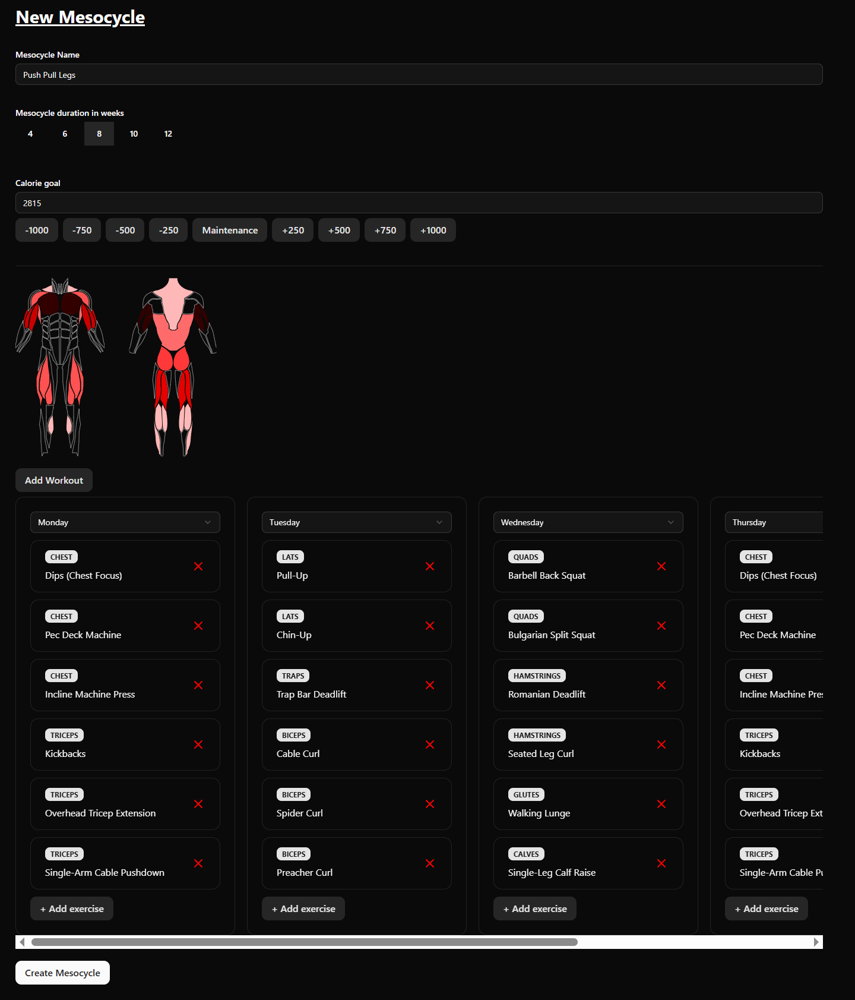

# TrainTrackr

## Fitness and Nutrition Tracker

TrainTrackr allows users to plan and track their workouts structured into mesocycles. The app shows you the exact workout to perform each day based on your plan. Every session is saved for easy progress tracking.

Users can also save custom food items with accurate nutrition values, and quickly calculate daily and weekly averages as well as macronutrients.

By combining nutrition tracking, body weight monitoring, and workout progress, you can clearly see whether your plan is working or needs adjustment.

## Tech Stack
**Backend**: NextJS Api, MongoDB, Clerk

**Frontend**: React, Tailwind, React Router, React Query, Zustand, Shadcn, Motion, i18n

## How to Use the App
### **Sign up**: 
  - Create an account with your email. You will receive a verification code.

### Onboarding
You will be asked to provide some basic information such as gender, age, height, and current activity level. This will be used to calculate your TDEE (Total Daily Energy Expenditure).

- **Dashboard**: Once you start tracking your progress, the dashboard will display:
  - Your daily and weekly calorie intake, averages, and macronutrients
  - Weight tracking with a chart showing daily changes
  - Mesocycle progress, including completed or missed workouts (requires an active mesocycle)

## Mesocycle
1. **Create a new Mesocycle**:
   - On the `New Mesocycle` page, enter the mesocycle name, duration, calorie goal, and select exercises for each day. The graphic will show which muscles are trained and how often.
   - Click `Create Mesocycle`
   

2. Activate a Mesocycle
    - All mesocycles are saved in the `My Mesocycles` page.
    - Click the `Activate` button to activate your mesocycle. The mesocycle will start the following Monday.
   

3. Workout
    - When a mesocycle is active, the app shows your scheduled workout for the day. For each exercise, you can log sets with weight and reps performed.
    - When you're done with your workout, click `Complete Workout` and you will be redirected to `Completed Workouts`.
    - There you can review every exercise and rep you’ve logged for reference and progress tracking.

## Nutrition
1. Create New Items
   - To create new food items, go to the `Nutrition` page and click `Create New Item`
   - Enter the item name, nutrition values per 100 grams, and optionally add portion sizes with weights in grams (slice, piece, spoon, etc.).
   - Click `Add` to save.

2. Add Items You Consumed Today
   - Click `Add Item`, select the food, and enter the amount in grams or portions.

3. The items will be added, and daily macronutrients will be calculated for that day.

4. Check the `Dashboard` to see nutrition values and averages.

## Measurements
On the `Measurements` page, you can log your body weight once per day and record measurements for different body parts. This data is used to calculate weight changes on the `Dashboard`.

### Recommendation
Track your nutrition and body weight every day. This way, you will know exactly how your weight changes and how many calories you are consuming, so you can adjust your intake to gain or lose weight as desired.